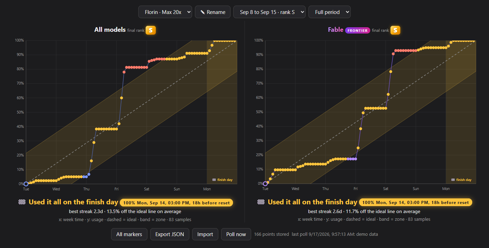
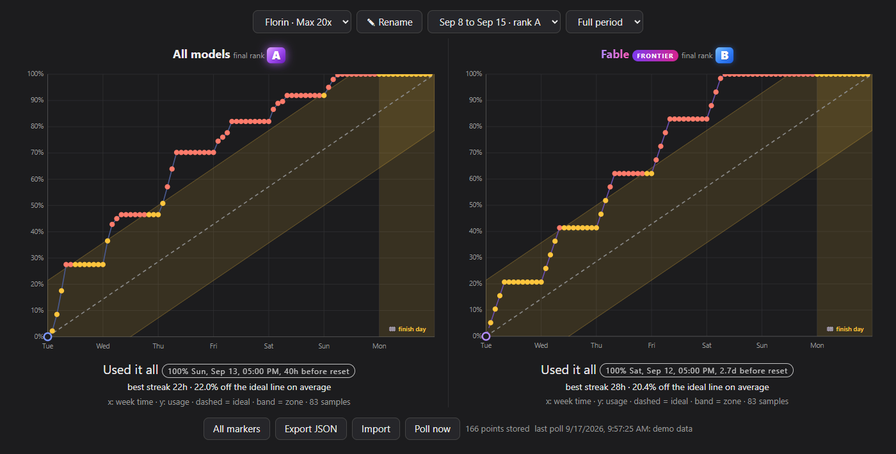
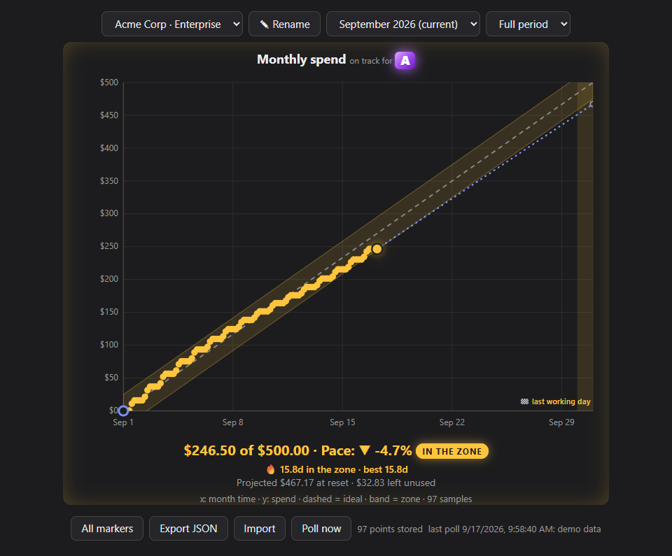

# Claude Weekly Usage Chart

Unofficial Chrome extension (MV3). Polls claude.ai weekly limits every 10 minutes and charts them against the ideal pace, with a rank for how close you finish to 100% at the reset. Not affiliated with Anthropic. Data stays in your browser.

## What it looks like

**Rank S: the ideal week.** The flat stretches are the hours away from work. Usage drifts under the dashed ideal line (blue dots, violet on Fable), overshoots it (red), comes back within a day and a half of pace of it (gold, "in the zone": 21 points on a week) and reaches 100% on the finish day, the last 24 hours before the reset. Nothing left unused, nothing blocked early.



**Rank A: ran out early.** Usage climbs faster than the line (red dots) and hits 100% 40 hours before the reset, so the limit blocks the last day. Each day early costs one rank: A, then B (the Fable chart here), then C.



**Monthly spend limit.** Seats with only a monthly $ cap (Enterprise) get one chart in money instead of percent. The period is the calendar month and the finish window is its last working day. Live periods show the pace, the current streak and where the spend is projected to land at the reset.



Screenshots come from `dev/demo.html?scenario=s`, `?scenario=a` and `?scenario=monthly`, rendered with synthetic data.

## Install (from this repo)

1. Download this repository (green "Code" button, "Download ZIP") and unzip it, or clone it.
2. Open `chrome://extensions`, turn on "Developer mode" (top right).
3. Click "Load unpacked" and pick the `extension` folder.
4. Stay logged in to claude.ai in that Chrome profile. The first sample arrives within a minute; click the toolbar icon to open the chart.

## Layout

* `extension/`: the unpacked extension. `manifest.json`, `background.js` (poller), `parse.js` (usage payload parser, import merge), `pace.js` (ideal line, zone, finish window, rank maths), `chart.html` + `chart.js` (chart page), `icons/`
* `dev/`: `test_parse.js`, `test_pace.js` (run under several TZ values), `test_poll.js` (background.js against a fake claude.ai: two weekly orgs, one monthly), `demo.html` (chart with fake data), `promo.html` (store tile source), `make_icons.py`, `build.py`
* `docs/`: README screenshots
* `store/`: listing copy, privacy policy, store images
* `dist/`: upload zip (generated)

## Commands (from this folder)

```bash
node dev/test_parse.js
```

```bash
node dev/test_pace.js
```

```bash
node dev/test_poll.js
```

```bash
python dev/make_icons.py
```

```bash
python dev/build.py
```

Demo: serve this folder over http (`python -m http.server 8741 --bind 127.0.0.1`) and open `http://127.0.0.1:8741/dev/demo.html`.

## Release

Bump `version` in `extension/manifest.json`, run `python dev/build.py`, upload the zip from `dist/`.
