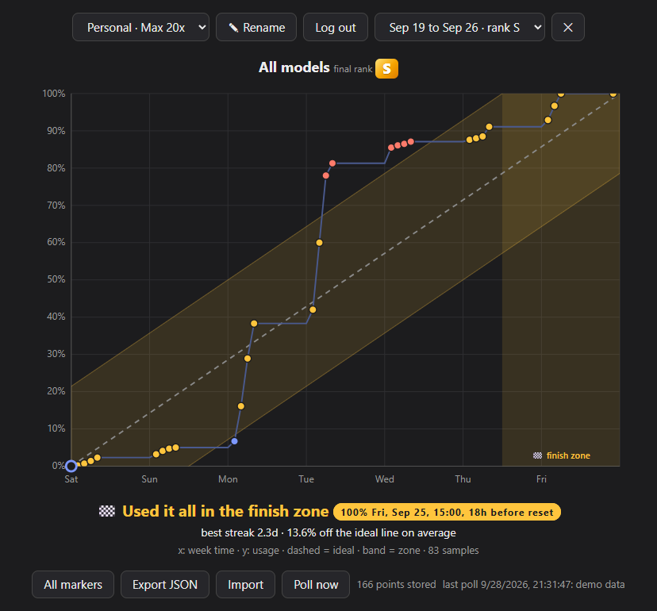
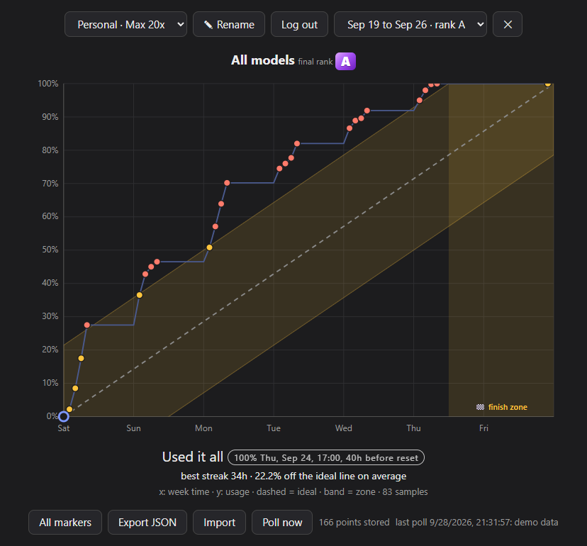
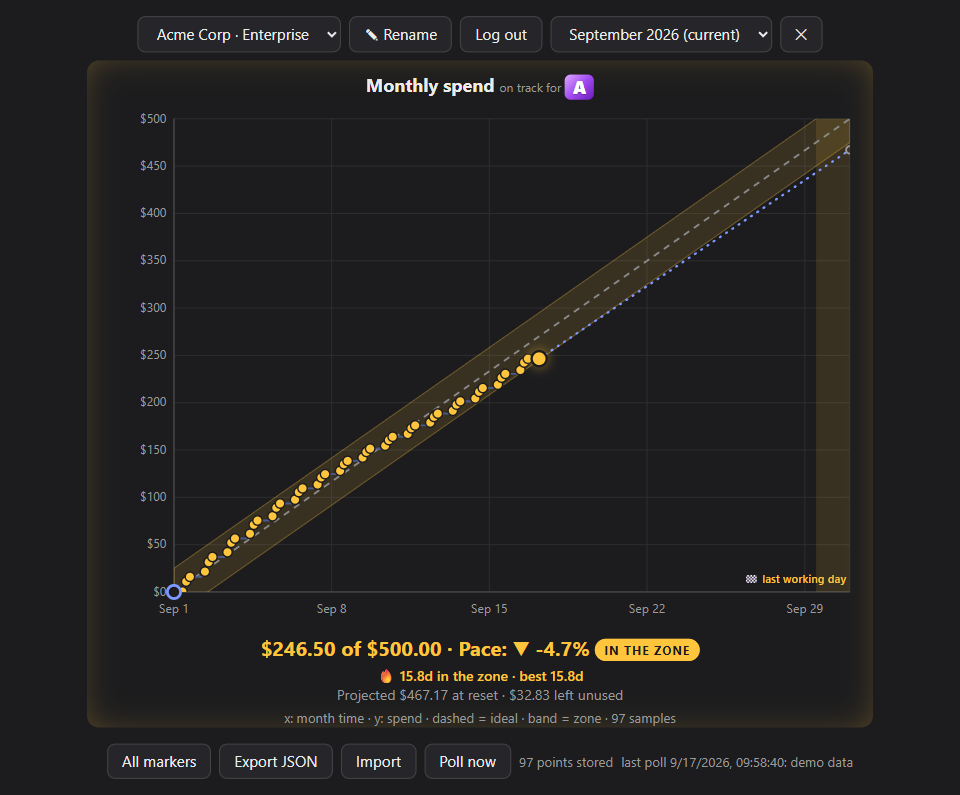
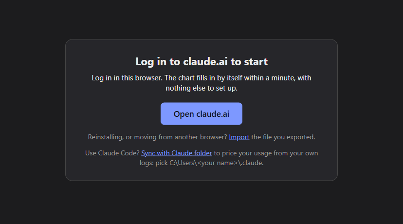

# Claude Weekly Usage Chart

Unofficial Chrome extension (MV3). Polls claude.ai weekly limits every minute, stores a point each time a value moves, and charts them against the ideal pace, with a rank for how close you finish to 100% at the reset. Tracks several claude.ai accounts at once, each one keeps updating while the browser is signed in to another. Not affiliated with Anthropic. Data stays in your browser.

## What it looks like

**Rank S: the ideal week.** The flat stretches are the hours away from work. Usage drifts under the dashed ideal line (blue dots), overshoots it (red), comes back within a day and a half of pace of it (gold, "in the zone": 21 points on a week) and reaches 100% in the finish zone, the last 36 hours before the reset (where the zone band reaches 100%, so finishing needs no late night). Nothing left unused, nothing blocked early. Ending at 95% or more without being blocked is S too.



**Rank A: ran out early.** Usage climbs faster than the line (red dots) and hits 100% 40 hours before the reset, so the limit blocks part of the last days. A blocked week never ranks S, and the blocked stretch costs half its share of the week.

**How the rank works.** Score = usage at the reset, minus half the share of the period the limit blocked before the finish window. Unused quota is wasted; hitting the limit early wastes none of it but stops work, so it costs half. S 95+, A 90+, B 75+, C 50+, else D. Hover the rank chip for the score.



**Monthly spend limit.** Seats with only a monthly $ cap (Enterprise) get one chart in money instead of percent. The period is the calendar month and the finish window is its last working day (through the weekend when the month ends on one). Live periods show the pace, the current streak and where the spend is projected to land at the reset.



**Zoom.** The chart opens on the whole period. Scroll over it to zoom in or out around the pointer; zoomed in, drag to move and double-click to return to the whole period. Dots a minute apart, which overlap on the whole week, come apart once zoomed in.

**Burn.** 🔥 "This session burned ..." counts from the end of the longest break of the last 24 hours (for most people the night) to now, with the rate per minute; 4 hours without a move ends the session. The peak is the fastest climb between two moves that are both timed to the minute (data polled every minute, on both sides of the climb), to the second.

**Dollars.** claude.ai reports plan limits only in whole percent, with no tokens or dollars, so the "All models" chart prices them at API list rates: "≈ $1,425 of $1,900 · Pace ...", the session burn and the share left unused. Until your own logs measure it, 1% of Max 20x ≈ $19 and of Max 5x ≈ $8.60, from Reddit audits that priced usage logs against the meter (September 2026; 5x = 20x over the 2.2x weekly ratio measured between the plans). Other plans stay in percent; monthly spend is in real money. **Sync with Claude folder** (click it once, or drop your `.claude` folder on the page) lets the extension read Claude Code's logs in your browser on every poll: each call priced at list, only dollars per minute kept, and kept after you delete the conversations. Once the logged calls cover at least 80% of a week's climb (5 points or more), the chart uses your measured value instead. The button disappears while the folder reads and comes back only if it can't (moved, deleted, or Chrome's permission gone).

Screenshots come from `dev/demo.html?scenario=s`, `?scenario=a`, `?scenario=monthly` and `?scenario=welcome` (the store picture: `?scenario=burn`), rendered with synthetic data.

## Install (from this repo)

1. Download this repository (green "Code" button, "Download ZIP") and unzip it, or clone it.
2. Open `chrome://extensions`, turn on "Developer mode" (top right).
3. Click "Load unpacked" and pick the `extension` folder.
4. Stay logged in to claude.ai in that Chrome profile. The first sample arrives within a minute; click the toolbar icon to open the chart. The chart opens by itself after the install; until there is a first reading it says what to do next:



## Several accounts

Every account the extension has seen keeps updating, even after the browser signs in to another one: it saves each account's claude.ai session key (local storage only; "Export JSON" includes them only if you say so when it asks, to reinstall without logging in again) and polls each account with its own key. Pick the account in the chart's account menu.

**claude.ai's own "Log out" becomes an account switch.** Normally it ends the session on claude.ai's side, which would stop that account's chart. The extension blocks that request (only the one claude.ai's page sends), clears the login in that window, and shows claude.ai's login page: log in to the next account, and the previous one keeps updating. The chart page has the same switch, plus the real logout:

* **+ Add account** (last entry of the account menu): clears the browser's claude.ai login in this browser only (the account stays saved and keeps updating) and opens the claude.ai login page for the next account.
* **Log out** (next to Rename): the account on screen stops updating and leaves the list, its session is ended on claude.ai, and the browser is signed out of it if it was the current login. Its stored points stay; logging in to it again brings it back.

**On a shared computer, use the chart page's Log out.** While the extension is installed, claude.ai's Log out button only switches accounts and leaves the session alive.

Logging in to another account in an Incognito window also works (turn on "Allow in Incognito" in the extension's Details first). An account stays on the list and keeps being polled until you press Log out. If claude.ai refuses its login (for example after a logout on another device), it shows "(signed out)" and resumes as soon as you log in to it again.

**How it works.** A browser holds one claude.ai login at a time, in the `sessionKey` cookie. The extension reads that cookie for every account it sees (`cookies` permission) and keeps the keys in its local storage. On each poll the browser's own login is requested normally. Every other saved account is requested with credentials omitted, and a temporary `declarativeNetRequest` session rule, limited to requests this extension sends to `claude.ai/api/`, sets the Cookie header to that account's key. Because credentials are omitted, nothing claude.ai answers can overwrite the browser's own login. claude.ai reissues session keys now and then, so the extension watches the response headers of its own requests (`webRequest`) and saves the new key in place of the old one. One more rule blocks the `POST /api/auth/logout` that claude.ai's page sends, which is what turns its Log out into a switch. Host access is `https://claude.ai/*` because cookies and these rules need the whole site, the extension still requests only the three API endpoints listed in [store/PRIVACY.md](store/PRIVACY.md), plus the logout request when you press the chart's Log out.

## Layout

* `extension/`: the unpacked extension. `manifest.json`, `background.js` (poller), `parse.js` (usage payload parser, import merge, Claude Code log reader for "Sync with Claude folder"), `pace.js` (ideal line, zone, finish window, rank maths), `chart.html` + `chart.js` (chart page; `HIDDEN_SERIES` lists limits that are recorded but not drawn, Fable today), `icons/`
* `dev/`: `test_parse.js`, `test_pace.js` (run under several TZ values), `test_poll.js` (background.js against a fake claude.ai: two weekly orgs, one monthly, several accounts), `test_chrome_multi.js` (the several-accounts plumbing in a real Chrome for Testing against a local fake claude.ai; needs Chrome for Testing and openssl, Windows path), `demo.html` (chart with fake data), `promo.html` (store tile source), `make_icons.py`, `build.py`
* `docs/`: README screenshots
* `store/`: listing copy, privacy policy, store images
* `dist/`: upload zip (generated)

## Commands (from this folder)

```bash
node dev/test_parse.js
```

```bash
node dev/test_pace.js
```

```bash
node dev/test_poll.js
```

```bash
node dev/test_chrome_multi.js
```

```bash
python dev/make_icons.py
```

```bash
python dev/build.py
```

Demo: serve this folder over http (`python -m http.server 8741 --bind 127.0.0.1`) and open `http://127.0.0.1:8741/dev/demo.html`.

## Release

Bump `version` in `extension/manifest.json`, run `python dev/build.py`, upload the zip from `dist/`.
